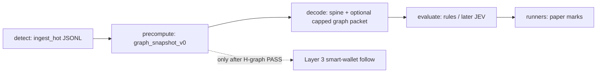

# Graph discovery brief v0 — wallets, creators, clusters, sequences

| | |
| --- | --- |
| **Research as-of** | 2026-09-23 |
| **Audience** | Graph / Scout / Proof / Helm (council overnight) |
| **Scope** | **Discovery only** — what Layer-2 graph needs next to feed a **later** filtered smart-wallet-follow layer. **Paper-first**, knowable-at-T, as-of-T edges. **Not** single-wallet copy-trading, **not** production graph plumbing theater. |
| **Context** | EXP-002c **INCOMPLETE closed**; council direction is **DISCOVERY** before EXP-002d. Spine-only evaluate rules failed lift; **H-graph** kill test: [EXP-004](../EXP/EXP-004-graph-creator-recurrence-v0.md) contract + CLI **landed on `main`** — **full-book score INCOMPLETE** until courier JSONL + marks on operator machine. Host `mal-core-0` live; Cursor↔Oracle access **LIVE** ([DEC-011](../DEC/DEC-011-cursor-oracle-access-cf-tunnel.md)). |
| **Locks** | Sealed **JSONL** = EXP provenance spine ([DEC-002](../DEC/DEC-002-memory-first-no-db-local.md), [DEC-009](../DEC/DEC-009-oracle-always-free-phase0-host.md), [DEC-010](../DEC/DEC-010-oracle-phase0-handoff-autonomy.md)). Postgres = Layer-2 **ops/state cache** only — not provenance SoT. Free create feed = **weak links** until RPC enrich proves EV ([DEC-005](https://github.com/vaanai/MAL/pull/8) draft PR #8, §4). Cheap-first; no paid RPC without Gate-1 meters ([DEC-008](../DEC/DEC-008-stack-phase-gates.md), [API-COST-LATENCY-BRIEF.md](API-COST-LATENCY-BRIEF.md)). |

**Primary sources in repo:** [ORACLE-PHASE0-HANDOFF.md](ORACLE-PHASE0-HANDOFF.md), [OBSERVE-JSONL-SCHEMA.md](OBSERVE-JSONL-SCHEMA.md), [REGIME-AT-INGEST-MATRIX.md](REGIME-AT-INGEST-MATRIX.md), [PUMPPORTAL-PAYLOAD-INVENTORY.md](PUMPPORTAL-PAYLOAD-INVENTORY.md), [DEC-006](../DEC/DEC-006-detect-decode-evaluate-runners.md), [DEC-007](../DEC/DEC-007-full-detect-book-anti-selection-bias.md).

**Scout alignment:** Parallel Scout Discovery run `bc-865e96ca` (Cursor Cloud) — **same vocabulary** for signals and falsifiers below; Graph owns relationship precompute, Scout owns regime gate + ingest law.

---

## 0. Scout soft constraints (v0 vocabulary)

Working law for Graph Discovery and any later cluster / smart-wallet **label** (not production follow bots).

| # | Constraint | Graph vocabulary |
| --- | --- | --- |
| **S1** | **Regime gate first** | Every cluster label, wallet tag, or graph snapshot MUST carry the parent row’s **`regime_id`** (or an explicit **`regime_gate=unknown`** stub with reason). Dimensions include bonding-curve **instruction lineage** (`instr=`), **fee** (`fee=`), **graduation / stage** (`stage=`, `market=`), **quote / pair asset** (`quote=`) per [REGIME-ENUM-V0.md](REGIME-ENUM-V0.md). **No cross-regime merge** — recurrence counts, bursts, and “clusters” are scoped per `regime_gate_key` (hash or normalized prefix of `regime_id` at ingest). |
| **S2** | **Knowable-as-of-T only** | Cluster **membership** and edges are fixed at **`T_decision`** with `t_precompute_as_of ≤ T_decision`. **No post-hoc cluster assignment** (no “this wallet was in the cluster all along” after later trades). **`t_ws` vs `t_event`** delta is **latency-as-data** (log, stratify); do not rewrite `T`. |
| **S3** | **Follow ≠ mirror** | Layer 3 **follow** means **feature / veto / select / enrich** on the paper → gated path — **never** “mirror this wallet” as the strategy. Graph v0 emits **capped scalars and falsifiers**, not copy-trade targets. |
| **S4** | **Executable windows** | Paper horizons **1s / 5s / 15s / 30s / 60s** ([DEC-006](../DEC/DEC-006-detect-decode-evaluate-runners.md)). **Prefer signals computable from sealed observe before or at `T_decision`** so they are **ready inside** the decision window. **Late enrich** (async RPC, Postgres L2 cache refresh) may update **cache** for **later** rows only — **not** as entry trigger for the same sealed `signature`. |
| **S5** | **Bonk / mayhem parked** | Do **not** define clusters or wallet sets around bonk/mayhem/pool venues unless work **necessarily** touches them ([EXP-002c](../EXP/EXP-002c-rules-v2-adverse-selection.md) Scout lock). Default population: bonding creates with parked flags excluded from cluster seeds. |
| **S6** | **Taxonomy + falsifiers only** | Discovery delivers **named hypotheses, regime gates, and kill falsifiers** — **not** mark densification or evaluate retune ([EXP-002c](../EXP/EXP-002c-rules-v2-adverse-selection.md), [EXP-003](../EXP/EXP-003-post-create-marks.md)). Outcome joins use **existing** marks; **INCOMPLETE** when arms lack priced coverage (EXP law), without inventing lift thresholds in briefs. |
| **S7** | **X / social = Layer 4** | **Not** a cluster seed for v0. No social edges, cashtag co-occurrence, or X-attached wallet lists in `graph_snapshot_v0`. |

**Graph soft prefs (unchanged):** prioritize **sealed-history creator age / prior-mints**, **recurring creator↔buyer** (weak then RPC), **early-wallet Δt clusters** when observe proves timing; **park** single-wallet PnL leaderboards, copy-trade framing, and **unverified funding** on the hot packet ([DEC-005](https://github.com/vaanai/MAL/pull/8) §4).

---

## 1. Executive summary

Layer-2 **entity / relationship / graph** is product-critical ([DEC-009](../DEC/DEC-009-oracle-always-free-phase0-host.md) § Product alignment). **EXP-004** landed offline precompute + gates in git ([`tools/exp004_graph_discovery`](../tools/exp004_graph_discovery.py), [EXP-004](../EXP/EXP-004-graph-creator-recurrence-v0.md)); **no** always-on graph workers, decode-time graph in evaluate, or Postgres-as-SoT graph tables yet. Oracle box has **Postgres** (`meme_core` / `mal_app`) + ops stubs — not provenance SoT ([ORACLE-ALWAYS-FREE-BOM-v0.md](ORACLE-ALWAYS-FREE-BOM-v0.md)).

**Smallest useful slice (EXP-004):** offline, **JSONL-first** **regime-gated** creator history (**age / prior-mints**), weak **creator↔buyer** recurrence, and (where sealed timing allows) **early-wallet Δt** from the **free create spine** — optional **`type=graph_snapshot_v0`** sidecar with `regime_id`, `regime_gate_key`, `t_precompute_as_of`, and `T_decision` ([DEC-005](https://github.com/vaanai/MAL/pull/8) §1, §3). Score **full detect book** per [DEC-007](../DEC/DEC-007-full-detect-book-anti-selection-bias.md) with **existing** marks at **1s/5s/15s/30s/60s**; **falsify H-graph** with taxonomy + gates (no mark densify, no invented lift). **Oracle book score** remains **INCOMPLETE** until operator runs CLI on courier JSONL + marks.

**Park:** multi-hop funding graphs, community detection at scale, metered `subscribeAccountTrade` / Birdeye wallet index, smart-wallet follow lists, and “graph scores in decode” before EXP-004 kill gates close.

---

## 2. Inventory — real vs empty theater

### 2.1 Implemented (Layer 1 spine — not graph)

| Asset | What it does | Graph relevance |
| --- | --- | --- |
| [observe/client.py](../observe/client.py) + [observe/regime.py](../observe/regime.py) | PumpPortal WS → sealed `ingest_hot` JSONL | Stamps **`traderPublicKey`** with `creator_verified=false` ([OBSERVE-JSONL-SCHEMA.md](OBSERVE-JSONL-SCHEMA.md)); **weak create-spine link** per DEC-005 §4 |
| [OBSERVE-JSONL-SCHEMA.md](OBSERVE-JSONL-SCHEMA.md) | `ingest_hot` + `outcome_mark` shapes | **No** graph row types yet |
| [tools/exp002_paper_runner.py](../tools/exp002_paper_runner.py) | Rules evaluate + marks join | **Graph scores out of scope** ([EXP-002](../EXP/EXP-002-evaluate-runner-v0.md) §3) |
| [tools/exp003_*](../tools/exp003_marks.py) | Post-create marks (RPC subsample) | Outcome meter for **H-graph A/B**, not graph features |
| [EXP-001](../EXP/EXP-001-regime-stage-mislabel.md) | Regime/stage mislabel | Explicitly excludes graph scores from scope |
| [tools/exp004_graph_discovery.py](../tools/exp004_graph_discovery.py) + [EXP-004](../EXP/EXP-004-graph-creator-recurrence-v0.md) | Offline H-G1…H-G4 precompute + full-book gates vs spine | **Discovery measurement** — not evaluate promotion |

### 2.2 Policy / architecture (real intent — not code)

| Asset | Graph content |
| --- | --- |
| [CONSTITUTION.md](../CONSTITUTION.md) §5 | **Capped hot packet** — graph depth and field caps are law |
| [REGIME-AT-INGEST-MATRIX.md](REGIME-AT-INGEST-MATRIX.md) | Creator = WS weak / RPC strong; **graph scores = separate capped packet**, never backfilled into `ingest_hot` |
| [DEC-006](../DEC/DEC-006-detect-decode-evaluate-runners.md) | Decode may attach **capped as-of-T graph when evidence exists** |
| [DEC-007](../DEC/DEC-007-full-detect-book-anti-selection-bias.md) | **Graph flags on full detect book**, not evaluate-pass only |
| [DEC-005](https://github.com/vaanai/MAL/pull/8) (draft PR #8) | `T_decision`, `t_precompute_as_of`, weak vs strong provenance |
| [ORACLE-PHASE0-HANDOFF.md](ORACLE-PHASE0-HANDOFF.md) §9 | Graph = wallets, creators, funding/interaction/temporal edges — **engineering choice deferred** |
| [LAB_STATE.md](../LAB_STATE.md) | **H-graph** kill: A/B at 1s/5s/15s/30s/60s vs spine-only |

### 2.3 Empty theater (do not mistake for progress)

| Item | Status in repo / host |
| --- | --- |
| **`meme_core` wallet / token / relationship tables** | **No SQL, no migrations, no ORM** in GitHub; handoff says “schema for implementation team” |
| **`/var/lib/mal` app subdirs** | Documented intent (JSONL, Postgres data dir) — **not** specified layout for `graph/` or `state/` in git |
| **Graph workers / precompute service** | **None** |
| **Capped graph packet JSON spec** | Listed in `LAB_STATE.md` Next work (hot-packet) — **not landed**; EXP-004 sidecar shape in CLI |
| **Decode-time graph scores in evaluate** | **Never used** in EXP-002 family |
| **Neo4j / graph DB / “wallet intelligence platform”** | **No** — would violate cheap-first and duplicate Postgres role |
| **PumpPortal metered trade/account WS for all mints** | **Not** spine; costs SOL + API key ([PUMPPORTAL-PAYLOAD-INVENTORY.md](PUMPPORTAL-PAYLOAD-INVENTORY.md) §4) — **not** graph v0 |
| **Birdeye / Dexscreener wallet or pair graph** | Birdeye **defer**; Dex **debug only** — not graph spine |

### 2.4 Oracle host (out of repo — do not invent)

Per [DEC-010](../DEC/DEC-010-oracle-phase0-handoff-autonomy.md): Postgres **16.15** on localhost, sealed JSONL and app dirs **planned** post–DEC-011. **This brief does not prescribe SSH ops or live schema apply** — only what to build in git first so bootstrap is not theater.

---

## 3. Need next vs park

### 3.1 Need next (smallest Graph Discovery slice)

**Goal:** Prove or kill whether **as-of-T relationship features** from **create-spine weak links** add **paper lift** on the **full bonding-create book** — same economic yardstick as EXP-002c, **without** fixing evaluate rules.

| Step | Deliverable | Owner bias |
| --- | --- | --- |
| **G0 — Spec** | `graph_snapshot_v0`: `parent_signature`, `mint`, `T_decision`, `t_precompute_as_of`, **`regime_id`**, **`regime_gate_key`**, capped `features{}`, `evidence_tier` (`weak_ws` \| `rpc_verified`), optional `latency_delta_ws_event_ms` (S2) | Graph + Scout |
| **G1 — Offline precompute** | Single-pass scan of sealed `ingest_hot` **bonding creates**, sorted by `T_decision`; rolling state **per `regime_gate_key`** only from rows with **`T_prior < T_decision`** (strict); bonk/mayhem excluded from seeds (S5) | Graph (`tools/`) |
| **G2 — Feature v0 (capped)** | ≤5 scalars aligned with Scout prefs: **`creator_age_seconds`** (first-seen → T), **`prior_mint_count_*`**, **`seconds_since_last_create`**, **`creator_buyer_recurrence_weak`** (same `traderPublicKey` prior `initialBuy`/`solAmount` pattern), **`early_wallet_dt_min_seconds`** (only if derivable from sealed rows before T — else omit, do not backfill) | Graph |
| **G3 — Proof join** | Join to EXP-002 labels by `signature`/`mint`; graph flags on **full book** (S6, DEC-007); outcome meter at **1/5/15/30/60s** with **signals required knowable at T** for in-window decode (S4); report **INCOMPLETE** arms per EXP-003 — **no densify to retune** | Proof |
| **G4 — Postgres (optional)** | **After** JSONL snapshot EXP is reproducible: idempotent upsert into `meme_core` **cache** tables for fast rolling windows on host — **still not** provenance | Scout + Graph |

**Why this order:** Reuses existing sealed population and marks; no new paid feeds; respects weak-link law until a **documented** RPC enrich EXP shows EV (separate child rows `type=regime_enrich` / `graph_enrich`, never in-place hot patch).

### 3.2 Park (theater or premature)

| Item | Why park |
| --- | --- |
| **Smart-wallet follow (Layer 3)** | Requires proven L2 signals + filter economics; not discovery |
| **Single-wallet copy-trading / “alpha wallet” / PnL mirror lists** | S3: follow is feature/veto/select/enrich — not mirror-wallet strategy |
| **Unverified funding on hot packet** | Funding path only in `graph_enrich` child rows; never silent hot upgrade (DEC-005 §4) |
| **Full funding-tree / mixer tracing** | Needs heavy RPC or paid index; no Gate-1 trip documented |
| **Community / NLP / X graph** | Layer 4 / defer; no X on host |
| **Real-time graph on every trade** | Metered PumpPortal WS; use only if a **later** EXP proves create-spine graph insufficient **and** meters justify |
| **Graph DB product** | Postgres adjacency + JSONL snapshots suffice for phase 0 |
| **Capped graph inside evaluate rules before EXP-004** | Would confound EXP-002 discovery (rules vs graph) |
| **Host bootstrap blocked on graph** | DEC-011 → dirs + ingest first; graph EXP can run on **laptop courier JSONL** like EXP-002 |

---

## 4. Candidate hypotheses — taxonomy, regime gates, falsifiers (as-of-T)

All definitions use **`T_decision`** ([DEC-005](https://github.com/vaanai/MAL/pull/8) §1). Prior events **`T_prior < T_decision`** only, scoped by **`regime_gate_key`** (S1). **Falsifiers** are pass/fail/INCOMPLETE per EXP gates — this brief does **not** state numeric lift targets.

### H-G1 — Sealed-history **creator age** / **prior-mints** (weak identity)

- **Entities:** `traderPublicKey` (reported creator); **regime:** same `regime_gate_key`.
- **At T:** `creator_age_seconds`, `prior_mint_count` (and optional windowed counts).
- **Falsifiers:** Stratified outcomes vs spine-only show **no separable arm** at any of **1/5/15/30/60s**; or **INCOMPLETE** priced coverage; or effect **vanishes** when split by `regime_id` / `instr=` / `fee=` (cross-regime leak).

### H-G2 — **Creator burst cluster** (temporal sequence, regime-gated)

- **Sequence:** Prior creates by same `P` within lookback `W` before T, same `regime_gate_key`.
- **At T:** `burst_count`, `min_gap_seconds` since previous create.
- **Falsifiers:** Burst flags **redundant** with H-G1 marginals; or collinear with **modal launch snapshot** at T (EXP-002c discovery pattern — attribute, do not retune rules).

### H-G3 — **Recurring creator↔buyer** (weak → strong)

- **Weak (create spine):** Same `P` as creator on prior mints **and** repeated `initialBuy` / `solAmount` signature at those `T_j < T` — **not** a distinct buyer wallet yet.
- **Strong (subsample `graph_enrich` only):** Distinct buyer pubkeys from RPC txs — **L2 cache**, must not trigger entry on the same `signature` if enrich completes after T (S4).
- **Falsifiers:** Weak and strong tiers **disagree** on stratification; or buyer recurrence **only** appears cross-regime (S1 fail).

### H-G4 — **Early-wallet Δt cluster** (timing proxy)

- **Intent:** Wallets (or weak pubkey identities) that appear within **Δt** of T on **sealed observe** before decision — latency-as-data for cluster tightness.
- **v0 bound:** Create feed alone may only expose **creator** timing; non-creator “early wallets” need trade/RPC subsample — label `cluster_tier=weak_creator_only` vs `enrich_trade` and **park** copy-trade interpretation.
- **Falsifiers:** Δt features **empty** on book; or **not ready** inside 1s window from sealed rows (S4); or clusters **unstable** under regime split.

### H-G5 — Reserve / launch-style sequence (spine-only)

- **At T:** Prior creates by same `P` — `initialBuy`, `solAmount`, `marketCapSol` at `T_j < T`.
- **Falsifiers:** Graph scalars **collinear** with spine reserves at T (no incremental falsifier beyond L1).

### H-G6 — Migration follow-through (cross-stage edge)

- **Edge:** create → later migration row same `mint` — knowable only **after** migration.
- **At create T:** **Not** a decode input (leak). Retrospective cohort label only; park for create-time graph v0.

**Sequence typing (v0 enum):** `edge_type ∈ {creator_age_prior_mints, creator_burst, creator_buyer_recurrence_weak, creator_buyer_recurrence_enrich, early_wallet_dt, reserve_history, stage_migration_retro}` — each record carries `as_of_T`, `t_precompute_as_of`, `regime_id`, `regime_gate_key`.

---

## 5. Data dependencies

### 5.1 On sealed create row today (no RPC)

| Field | Use | Tier |
| --- | --- | --- |
| `t_ws`, `t_event` | `T_decision`, ordering | Spine |
| `signature`, `mint` | Join keys | Spine |
| `traderPublicKey` | Weak creator wallet | Weak ([matrix](REGIME-AT-INGEST-MATRIX.md) creator row) |
| `initialBuy`, `solAmount`, reserves, `marketCapSol` | Launch-style history per creator | Weak WS |
| `bondingCurveKey` | Future tx-graph anchor | Weak |
| `regime_id`, `stage`, `knowable_at_t` | Stratification / filters | Spine |
| `ws_payload` | Verbatim audit | Spine |

### 5.2 Background enrich (new JSONL only — not v0 blocker)

| Enrich | Purpose | Gate |
| --- | --- | --- |
| `type=regime_enrich` | `creator` pubkey verify, `instr`, fee | Matrix async table; subsample-first |
| `type=graph_enrich` | Prior txs, cosigners, funding parent | **Subsample** like EXP-003; public RPC until 429 audit |
| RPC `getSignaturesForAddress` on `traderPublicKey` | Strong recurrence / funding | **Gate 1** if miss-rate attributes to RPC |

### 5.3 Outcomes (already planned)

| Source | Use |
| --- | --- |
| `outcome_mark` / EXP-003 marks | H-graph horizons; **not** graph features |

### 5.4 Postgres (cache fields — post-EXP sketch only)

Illustrative, **not** migration authority: `wallet_pubkey`, `first_seen_t`, `last_create_t`, `create_count_7d`, `last_snapshot_id` — refreshed from JSONL snapshots, **rebuildable** from spine.

---

## 6. Relationship to pipeline and Layer 3

- **Today:** EXP-002 skips PRE → graph; DISCOVERY scores PRE **in parallel** to rules (S6 — no evaluate retune).
- **Layer 3 (later):** **Follow** = graph/L1 features as **veto, select, enrich** into paper → gated path (S3). v0 does **not** emit mirror-wallet strategies or single-wallet PnL copy lists.

---

## 7. Explicit non-goals (Graph Discovery v0)

1. Live trading, signing, wallet keys, or execution surface choice (Axiom / Phantom / …).
2. Paid Birdeye / Helius wallet index / gRPC streaming for graph.
3. Dexscreener, **X/social cluster seeds**, or social edges on spine or graph packets (S7).
4. Postgres as provenance or EXP SoT; mutating sealed `ingest_hot` rows.
5. Neo4j, managed graph SaaS, or multi-service graph mesh on `mal-core-0`.
6. Smart-wallet **mirror** lists, copy-trade bots, or “track wallet X” as the strategy (S3).
7. Claiming `traderPublicKey` = on-chain `creator` without `creator_verified` or child enrich row.
8. Graph-driven evaluate rule changes **before** EXP-004-style kill test closes.
9. SSH / tunnel / live Oracle changes by agents ([DEC-011](../DEC/DEC-011-cursor-oracle-access-cf-tunnel.md)).

---

## 8. Meters and spend (graph-specific)

| Meter | Trip condition (document in EXP) | Action |
| --- | --- | --- |
| **Create-spine miss** | WS gap / parse failure rate | Scout ingest — not graph |
| **RPC 429 on wallet history** | 7d log above DEC-008 Gate 1 tolerance | Escalate Helm; **not** default in v0 |
| **Mark holes** | priced_n below EXP arm floor | **INCOMPLETE** — same as EXP-002; **forbidden:** densify marks to retune graph (S6) |
| **Graph compute** | CPU on 2 OCPU box | Batch offline; no always-on graph service until measured need |

**No paid RPC recommendation** in v0 path — public RPC subsample only, aligned with [EXP-003](../EXP/EXP-003-post-create-marks.md) discipline.

---

## 9. EXP-004 — Graph creator-recurrence v0 (**landed — run locally**)

| Field | Value |
| --- | --- |
| **ID** | **`EXP-004-graph-creator-recurrence-v0`** |
| **Status** | Tooling on `main` branch path: [EXP-004](../EXP/EXP-004-graph-creator-recurrence-v0.md); CLI `python -m tools.exp004_graph_discovery`. **Scored result INCOMPLETE** until operator courier JSONL + marks (cloud agents have no Vaan book). |
| **Hypothesis** | Regime-gated, capped as-of-T **H-G1…H-G4** vs spine-only on **full detect book** at **1/5/15/30/60s** ([H-graph](../LAB_STATE.md)). **H-G5/H-G6** taxonomy only — not scored for lift. |
| **Falsifiers** | No separable arm vs spine; **no_lift_vs_random**; **INCOMPLETE** `priced_n`; regime-stratified collapse (S1); H-G4 empty on create-spine (honest, not fabricated). **No** mark densify retune (S6). |
| **Depends on** | Sealed JSONL; existing `--marks`; DEC-005 weak create-spine; DEC-007 book law |
| **Out of scope** | Evaluate rule promotion; Layer 3 wallet follow; paid index; Scout EXP stub |

Scout taxonomy cross-link (I1–I4, Park): [DISCOVERY-WALLET-FOLLOW-SIGNALS.md](DISCOVERY-WALLET-FOLLOW-SIGNALS.md). Alternate name (unused): `EXP-004-graph-weak-creator-sequences-v0`.

---

## 10. Open questions (needs council / owner)

1. **Lookback caps:** 24h vs 7d vs all-time for `prior_n` — trade memory vs non-stationarity of meme meta.
2. **Identity:** Treat `traderPublicKey` swaps / RPC `creator` mismatch as separate entities or merge via enrich?
3. **Packet shape:** Side file `graph-YYYY-MM-DD.jsonl` vs sibling type on main observe file (prefer **side file** to keep spine pure).
4. **Bonk/mayhem:** Stay parked (S5) unless a future DEC unparks ingest.
5. **`regime_gate_key` normalization:** Full `regime_id` string vs hashed prefix for state keys — Scout/Graph pick one in G0 spec.
6. **When to mirror Postgres:** After DEC-011 bootstrap only, or laptop JSONL sufficient until host ingest is live?

---

## 11. Primary sources

- Lab: files cited above; [DEC-005 draft](https://github.com/vaanai/MAL/pull/8)
- PumpPortal WS: [real-time docs](https://pumpportal.fun/data-api/real-time/)
- Solana RPC limits: [clusters](https://solana.com/docs/references/clusters)
