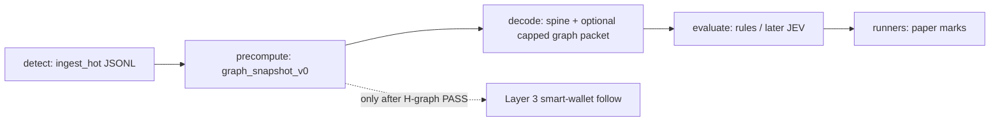

# Graph discovery brief v0 — wallets, creators, clusters, sequences

| | |
| --- | --- |
| **Research as-of** | 2026-09-23 |
| **Audience** | Graph / Scout / Proof / Helm (council overnight) |
| **Scope** | **Discovery only** — what Layer-2 graph needs next to feed a **later** filtered smart-wallet-follow layer. **Paper-first**, knowable-at-T, as-of-T edges. **Not** single-wallet copy-trading, **not** production graph plumbing theater. |
| **Context** | EXP-002c **INCOMPLETE closed**; council direction is **DISCOVERY** before EXP-002d. Spine-only evaluate rules failed lift; **H-graph** (`LAB_STATE.md`) remains unmeasured. Host `mal-core-0` is live but agents have **no SSH**; bootstrap (dirs, `meme_core` schema, host JSONL) waits on [DEC-011](../DEC/DEC-011-cursor-oracle-access-cf-tunnel.md). |
| **Locks** | Sealed **JSONL** = EXP provenance spine ([DEC-002](../DEC/DEC-002-memory-first-no-db-local.md), [DEC-009](../DEC/DEC-009-oracle-always-free-phase0-host.md), [DEC-010](../DEC/DEC-010-oracle-phase0-handoff-autonomy.md)). Postgres = Layer-2 **ops/state cache** only — not provenance SoT. Free create feed = **weak links** until RPC enrich proves EV ([DEC-005](https://github.com/vaanai/MAL/pull/8) draft PR #8, §4). Cheap-first; no paid RPC without Gate-1 meters ([DEC-008](../DEC/DEC-008-stack-phase-gates.md), [API-COST-LATENCY-BRIEF.md](API-COST-LATENCY-BRIEF.md)). |

**Primary sources in repo:** [ORACLE-PHASE0-HANDOFF.md](ORACLE-PHASE0-HANDOFF.md), [OBSERVE-JSONL-SCHEMA.md](OBSERVE-JSONL-SCHEMA.md), [REGIME-AT-INGEST-MATRIX.md](REGIME-AT-INGEST-MATRIX.md), [PUMPPORTAL-PAYLOAD-INVENTORY.md](PUMPPORTAL-PAYLOAD-INVENTORY.md), [DEC-006](../DEC/DEC-006-detect-decode-evaluate-runners.md), [DEC-007](../DEC/DEC-007-full-detect-book-anti-selection-bias.md).

---

## 1. Executive summary

Layer-2 **entity / relationship / graph** is product-critical ([DEC-009](../DEC/DEC-009-oracle-always-free-phase0-host.md) § Product alignment) but **unimplemented in git** beyond naming, matrix rows, and constitution caps. The live Oracle box has **Postgres installed** (`meme_core` / `mal_app`) with **no checked-in schema, migrations, or graph workers** — only policy text and BOM “bootstrap later” bullets ([ORACLE-ALWAYS-FREE-BOM-v0.md](ORACLE-ALWAYS-FREE-BOM-v0.md) §5, §Next).

**Smallest useful next slice:** offline, **JSONL-first** **creator recurrence** and **weak wallet identity** from the **free create spine** only — emit **new** `type=graph_snapshot_v0` lines (or sidecar JSONL) with explicit `t_precompute_as_of` / `T_decision` law ([DEC-005](https://github.com/vaanai/MAL/pull/8) §1, §3), score **full detect book** outcomes per [DEC-007](../DEC/DEC-007-full-detect-book-anti-selection-bias.md), and **kill H-graph** if capped features do not lift vs spine-only at 60s. **Do not** stand up Neo4j, wallet-index APIs, or Postgres-as-SoT graph tables until this paper slice closes or fails.

**Park:** multi-hop funding graphs, community detection at scale, metered `subscribeAccountTrade` / Birdeye wallet index, smart-wallet follow lists, and “graph scores in decode” before a scored EXP.

---

## 2. Inventory — real vs empty theater

### 2.1 Implemented (Layer 1 spine — not graph)

| Asset | What it does | Graph relevance |
| --- | --- | --- |
| [observe/client.py](../observe/client.py) + [observe/regime.py](../observe/regime.py) | PumpPortal WS → sealed `ingest_hot` JSONL | Stamps **`traderPublicKey`** with `creator_verified=false` ([OBSERVE-JSONL-SCHEMA.md](OBSERVE-JSONL-SCHEMA.md)); **weak create-spine link** per DEC-005 §4 |
| [OBSERVE-JSONL-SCHEMA.md](OBSERVE-JSONL-SCHEMA.md) | `ingest_hot` + `outcome_mark` shapes | **No** graph row types yet |
| [tools/exp002_paper_runner.py](../tools/exp002_paper_runner.py) | Rules evaluate + marks join | **Graph scores out of scope** ([EXP-002](../EXP/EXP-002-evaluate-runner-v0.md) §3) |
| [tools/exp003_*](../tools/exp003_marks.py) | Post-create marks (RPC subsample) | Outcome meter for **H-graph A/B**, not graph features |
| [EXP-001](../EXP/EXP-001-regime-stage-mislabel.md) | Regime/stage mislabel | Explicitly excludes graph scores from scope |

### 2.2 Policy / architecture (real intent — not code)

| Asset | Graph content |
| --- | --- |
| [CONSTITUTION.md](../CONSTITUTION.md) §5 | **Capped hot packet** — graph depth and field caps are law |
| [REGIME-AT-INGEST-MATRIX.md](REGIME-AT-INGEST-MATRIX.md) | Creator = WS weak / RPC strong; **graph scores = separate capped packet**, never backfilled into `ingest_hot` |
| [DEC-006](../DEC/DEC-006-detect-decode-evaluate-runners.md) | Decode may attach **capped as-of-T graph when evidence exists** |
| [DEC-007](../DEC/DEC-007-full-detect-book-anti-selection-bias.md) | **Graph flags on full detect book**, not evaluate-pass only |
| [DEC-005](https://github.com/vaanai/MAL/pull/8) (draft PR #8) | `T_decision`, `t_precompute_as_of`, weak vs strong provenance |
| [ORACLE-PHASE0-HANDOFF.md](ORACLE-PHASE0-HANDOFF.md) §9 | Graph = wallets, creators, funding/interaction/temporal edges — **engineering choice deferred** |
| [LAB_STATE.md](../LAB_STATE.md) | **H-graph** kill: A/B at 1s/5s/15s/30s/60s vs spine-only |

### 2.3 Empty theater (do not mistake for progress)

| Item | Status in repo / host |
| --- | --- |
| **`meme_core` wallet / token / relationship tables** | **No SQL, no migrations, no ORM** in GitHub; handoff says “schema for implementation team” |
| **`/var/lib/mal` app subdirs** | Documented intent (JSONL, Postgres data dir) — **not** specified layout for `graph/` or `state/` in git |
| **Graph workers / precompute service** | **None** |
| **Capped graph packet JSON spec** | Listed in `LAB_STATE.md` Next work #6 — **not landed** |
| **Decode-time graph scores in evaluate** | **Never used** in EXP-002 family |
| **Neo4j / graph DB / “wallet intelligence platform”** | **No** — would violate cheap-first and duplicate Postgres role |
| **PumpPortal metered trade/account WS for all mints** | **Not** spine; costs SOL + API key ([PUMPPORTAL-PAYLOAD-INVENTORY.md](PUMPPORTAL-PAYLOAD-INVENTORY.md) §4) — **not** graph v0 |
| **Birdeye / Dexscreener wallet or pair graph** | Birdeye **defer**; Dex **debug only** — not graph spine |

### 2.4 Oracle host (out of repo — do not invent)

Per [DEC-010](../DEC/DEC-010-oracle-phase0-handoff-autonomy.md): Postgres **16.15** on localhost, sealed JSONL and app dirs **planned** post–DEC-011. **This brief does not prescribe SSH ops or live schema apply** — only what to build in git first so bootstrap is not theater.

---

## 3. Need next vs park

### 3.1 Need next (smallest Graph Discovery slice)

**Goal:** Prove or kill whether **as-of-T relationship features** from **create-spine weak links** add **paper lift** on the **full bonding-create book** — same economic yardstick as EXP-002c, **without** fixing evaluate rules.

| Step | Deliverable | Owner bias |
| --- | --- | --- |
| **G0 — Spec** | `graph_snapshot_v0` JSONL line shape: `parent_signature`, `mint`, `T_decision`, `t_precompute_as_of`, capped `features{}`, `evidence_tier` (`weak_ws` \| `rpc_verified`), link to [DEC-004](../DEC/DEC-004-regime-id-encoding.md) `regime_id` | Graph + Scout |
| **G1 — Offline precompute** | Single-pass (or day-chunked) scan of sealed `ingest_hot` creates sorted by `T_decision`; rolling state **only** from rows with `t_ws` (or `t_event`) **&lt; current** `T_decision` | Graph (tooling in `tools/`) |
| **G2 — Feature v0 (capped)** | ≤5 scalars, e.g. `creator_prior_create_count_24h`, `creator_prior_create_count_7d`, `creator_seconds_since_last_create`, `creator_median_initial_buy_sol_prior`, `wallet_is_repeat_creator` (same `traderPublicKey`) | Graph |
| **G3 — Proof join** | Join snapshots to EXP-002 book by `signature`/`mint`; stratify graph flags on **runners and rejects** ([DEC-007](../DEC/DEC-007-full-detect-book-anti-selection-bias.md)); primary horizon **60s**; gates mirror H-graph in `LAB_STATE.md` | Proof |
| **G4 — Postgres (optional)** | **After** JSONL snapshot EXP is reproducible: idempotent upsert into `meme_core` **cache** tables for fast rolling windows on host — **still not** provenance | Scout + Graph |

**Why this order:** Reuses existing sealed population and marks; no new paid feeds; respects weak-link law until a **documented** RPC enrich EXP shows EV (separate child rows `type=regime_enrich` / `graph_enrich`, never in-place hot patch).

### 3.2 Park (theater or premature)

| Item | Why park |
| --- | --- |
| **Smart-wallet follow (Layer 3)** | Requires proven L2 signals + filter economics; not discovery |
| **Single-wallet copy-trading / “alpha wallet” lists** | Explicit non-goal; conflicts with filtered-follow product |
| **Full funding-tree / mixer tracing** | Needs heavy RPC or paid index; no Gate-1 trip documented |
| **Community / NLP / X graph** | Layer 4 / defer; no X on host |
| **Real-time graph on every trade** | Metered PumpPortal WS; use only if a **later** EXP proves create-spine graph insufficient **and** meters justify |
| **Graph DB product** | Postgres adjacency + JSONL snapshots suffice for phase 0 |
| **Capped graph inside evaluate rules before EXP-004** | Would confound EXP-002 discovery (rules vs graph) |
| **Host bootstrap blocked on graph** | DEC-011 → dirs + ingest first; graph EXP can run on **laptop courier JSONL** like EXP-002 |

---

## 4. Candidate hypotheses and sequence definitions (as-of-T, thin enough to kill)

All definitions use **`T_decision`** per sealed create row ([DEC-005](https://github.com/vaanai/MAL/pull/8) §1: `t_event` if non-null else `t_ws`). **State for features at `T`** may only include prior events with **`T_prior < T_decision`** (strict).

### H-G1 — Creator serial launcher (weak identity)

- **Entity:** `traderPublicKey` as **reported** creator wallet (weak).
- **At T:** `prior_n = count(creates where traderPublicKey = P and T_i < T)`.
- **Kill:** Runner 60s mean vs spine-only **no lift** when stratifying `prior_n ≥ 1` vs `prior_n = 0` on full book; or lift only on tiny priced_n.

### H-G2 — Creator burst / cluster (temporal sequence)

- **Sequence:** Within lookback `W` (e.g. 1h), creates with same `P` where `T_i ∈ (T−W, T)`.
- **At T:** `burst_count`, `min_gap_seconds` since previous create by `P`.
- **Kill:** No stable lift vs H-G1 marginals; or burst correlates only with **modal launch snapshot** (EXP-002c adverse-selection pattern).

### H-G3 — Recurring collaborator (multi-wallet — **needs enrich, phase G1.5**)

- **Weak proxy v0 (create feed only):** Same `traderPublicKey` appears as creator on mint A and mint B — **not** co-signer detection.
- **Strong (RPC child packet):** Within tx `T`, second signer or known program-derived address — **only** in `graph_enrich` rows after `getTransaction` on **subsample**; compare lift weak vs strong; kill if weak flags invert after RPC verify.

### H-G4 — Reserve / launch-style sequence (spine-only)

- **At T:** Prior creates by same `P` — distribution of `initialBuy`, `solAmount`, `marketCapSol` at **their** `T_j < T`.
- **Kill:** Graph adds nothing beyond EXP-002c “modal launch” failure mode (features collinear with spine reserves).

### H-G5 — Migration follow-through (cross-stage edge)

- **Entity edge:** create `signature` → later `subscribeMigration` row same `mint` (knowable only **after** migration event).
- **At create T:** **Not** knowable — must be **separate** post-migration label for **retrospective** cohort studies, **not** decode input at create T without leak. Park for v0 create-time graph; note for later **stage-transition** EXP.

**Sequence typing (v0 enum):** `edge_type ∈ {creator_repeat, creator_burst, weak_same_pubkey, enrich_cosigner}` with `as_of_T` and `t_precompute_as_of` on every emitted edge record.

---

## 5. Data dependencies

### 5.1 On sealed create row today (no RPC)

| Field | Use | Tier |
| --- | --- | --- |
| `t_ws`, `t_event` | `T_decision`, ordering | Spine |
| `signature`, `mint` | Join keys | Spine |
| `traderPublicKey` | Weak creator wallet | Weak ([matrix](REGIME-AT-INGEST-MATRIX.md) creator row) |
| `initialBuy`, `solAmount`, reserves, `marketCapSol` | Launch-style history per creator | Weak WS |
| `bondingCurveKey` | Future tx-graph anchor | Weak |
| `regime_id`, `stage`, `knowable_at_t` | Stratification / filters | Spine |
| `ws_payload` | Verbatim audit | Spine |

### 5.2 Background enrich (new JSONL only — not v0 blocker)

| Enrich | Purpose | Gate |
| --- | --- | --- |
| `type=regime_enrich` | `creator` pubkey verify, `instr`, fee | Matrix async table; subsample-first |
| `type=graph_enrich` | Prior txs, cosigners, funding parent | **Subsample** like EXP-003; public RPC until 429 audit |
| RPC `getSignaturesForAddress` on `traderPublicKey` | Strong recurrence / funding | **Gate 1** if miss-rate attributes to RPC |

### 5.3 Outcomes (already planned)

| Source | Use |
| --- | --- |
| `outcome_mark` / EXP-003 marks | H-graph horizons; **not** graph features |

### 5.4 Postgres (cache fields — post-EXP sketch only)

Illustrative, **not** migration authority: `wallet_pubkey`, `first_seen_t`, `last_create_t`, `create_count_7d`, `last_snapshot_id` — refreshed from JSONL snapshots, **rebuildable** from spine.

---

## 6. Relationship to pipeline and Layer 3

- **Today:** EXP-002 skips PRE → graph; DISCOVERY should score PRE **in parallel** to rules, not inside rules v2/v3 tuning.
- **Layer 3** consumes **filtered** wallet **sets** derived from L1+L2 — **never** blind copy. v0 does not pick wallets to follow; it only tests whether **creator-centric** caps help **create-time** paper.

---

## 7. Explicit non-goals (Graph Discovery v0)

1. Live trading, signing, wallet keys, or execution surface choice (Axiom / Phantom / …).
2. Paid Birdeye / Helius wallet index / gRPC streaming for graph.
3. Dexscreener or social edges on spine or graph packets.
4. Postgres as provenance or EXP SoT; mutating sealed `ingest_hot` rows.
5. Neo4j, managed graph SaaS, or multi-service graph mesh on `mal-core-0`.
6. Smart-wallet follow lists, copy-trade bots, or “track wallet X” product.
7. Claiming `traderPublicKey` = on-chain `creator` without `creator_verified` or child enrich row.
8. Graph-driven evaluate rule changes **before** EXP-004-style kill test closes.
9. SSH / tunnel / live Oracle changes by agents ([DEC-011](../DEC/DEC-011-cursor-oracle-access-cf-tunnel.md)).

---

## 8. Meters and spend (graph-specific)

| Meter | Trip condition (document in EXP) | Action |
| --- | --- | --- |
| **Create-spine miss** | WS gap / parse failure rate | Scout ingest — not graph |
| **RPC 429 on wallet history** | 7d log above DEC-008 Gate 1 tolerance | Escalate Helm; **not** default in v0 |
| **Mark holes** | priced_n &lt; 10 | INCOMPLETE — same as EXP-002 |
| **Graph compute** | CPU on 2 OCPU box | Batch offline; no always-on graph service until measured need |

**No paid RPC recommendation** in v0 path — public RPC subsample only, aligned with [EXP-003](../EXP/EXP-003-post-create-marks.md) discipline.

---

## 9. Suggested next EXP (do not run in this PR)

| Field | Proposed value |
| --- | --- |
| **ID** | **`EXP-004-graph-creator-recurrence-v0`** |
| **Hypothesis** | Capped as-of-T **creator recurrence** features from weak create spine improve **60s** paper lift vs spine-only on **full detect book** ([H-graph](../LAB_STATE.md)). |
| **Kill** | No stable lift at 1s/5s/15s/30s/60s; or lift disappears when stratified by regime; or graph flags redundant with reserve modal (H-G4). |
| **Depends on** | Sealed JSONL; existing `--marks`; DEC-005 clocks when merged; DEC-007 book law |
| **Out of scope** | Evaluate rule promotion; Layer 3 wallet follow; paid index |

Alternate name if council prefers sequence emphasis: `EXP-004-graph-weak-creator-sequences-v0`.

---

## 10. Open questions (needs council / owner)

1. **Lookback caps:** 24h vs 7d vs all-time for `prior_n` — trade memory vs non-stationarity of meme meta.
2. **Identity:** Treat `traderPublicKey` swaps / RPC `creator` mismatch as separate entities or merge via enrich?
3. **Packet shape:** Side file `graph-YYYY-MM-DD.jsonl` vs sibling type on main observe file (prefer **side file** to keep spine pure).
4. **Bonk/mayhem:** Stay parked in graph features per EXP-002c Scout lock.
5. **When to mirror Postgres:** After DEC-011 bootstrap only, or laptop JSONL sufficient until host ingest is live?

---

## 11. Primary sources

- Lab: files cited above; [DEC-005 draft](https://github.com/vaanai/MAL/pull/8)
- PumpPortal WS: [real-time docs](https://pumpportal.fun/data-api/real-time/)
- Solana RPC limits: [clusters](https://solana.com/docs/references/clusters)
