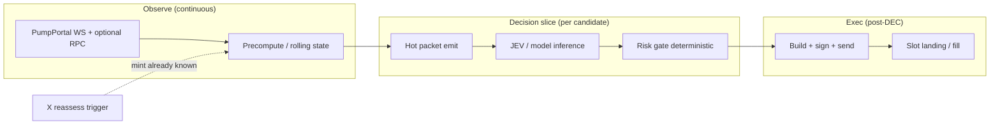

# Starter stack options brief — JEV path, social, create feeds, trial stack

| | |
| --- | --- |
| **Research as-of** | 2026-09-20 |
| **Audience** | Vaan / Helm / Scout / Graph / Proof |
| **Scope** | Options for observe → packet → JEV → risk gate → exec; **not** a single mandated stack |
| **Lab locks** | On-chain observe first; X = reassess/accelerator only; measure before paid RPC/gRPC; Birdeye paid deferred; Dexscreener debug-only; local-first; soft **~$0–60/mo** infra extras (+ team Cursor **~$60/mo** LLM separate); phase-0 observe live via PumpPortal WS + sealed JSONL ([DEC-003](../DEC/DEC-003-regime-at-ingest-v0.md), [DEC-004](../DEC/DEC-004-regime-id-encoding.md)); **no buy-infra-first** |

Companion detail: [API-COST-LATENCY-BRIEF.md](API-COST-LATENCY-BRIEF.md), [REGIME-AT-INGEST-MATRIX.md](REGIME-AT-INGEST-MATRIX.md).

---

## Executive framing

MAL is **not** choosing one vendor today. This brief maps **options**, **honest latency budgets**, and **what to measure** before spend. Execution code is out of scope; the question is what infrastructure and packet design make **trial-and-error toward profitable exec** possible under constitution locks.

**JEV** (lab usage): a **capped, knowable-at-T decision packet** produced after rolling precompute—inputs to a fast model or rule stack, not a single model brand.

---

## 1) JEV / hot path — where a fast decision model sits

### 1.1 Pipeline (logical, not deployment diagram)

| Stage | Role | Knowable-at-T | Typical owner |
| --- | --- | --- | --- |
| **Precompute** | Rolling curves, creator stats, recent trade histograms, graph caps | Only state updated **before** candidate `T` | Graph + Scout |
| **Hot packet** | First **immutable** spine row per event (`regime_id`, `t_ws`, stage, reserves) | [REGIME-AT-INGEST-MATRIX](REGIME-AT-INGEST-MATRIX.md) | Scout |
| **JEV** | Score / action from capped packet (ML or rules); **&lt;10 ms** target class on CPU for v0 | Packet fields only | Helm experiments |
| **Risk gate** | Hard limits (size, stage, liquidity, creator flags); same inputs → same outcome | Packet + gate config version | Proof + DEC |
| **Exec** | Tx build, priority fee, route (bonding vs pool), optional bundle | Post-gate only; **deferred** phase 0 | Future exec DEC |

**Social path:** X/Twitter may only **re-prioritize reassess** on mints **already** on the observe spine—not mint discovery ([CONSTITUTION](../CONSTITUTION.md) §1–2).

### 1.2 Latency budget table (realistic vs marketing)

Numbers are **planning buckets** for Pump.fun meme flow (bonding + migration). Vendor “sub-ms gRPC” claims are **directional** unless MAL logs Δ on the same signature ([API brief §3](API-COST-LATENCY-BRIEF.md)).

| Segment | What it is | Realistic budget (local-first, phase 0–1) | What ms actually buy on Pump memes | Marketing often implies |
| --- | --- | --- | --- | --- |
| **Observe latency** | `t_event` → `t_ws` (or gRPC) | **50–500 ms** p50 class vs slot; PumpPortal FAQ **&lt;100 ms behind gRPC** from NYC ([FAQ](https://pumpportal.fun/FAQ/)) | Seeing create **before** most manual traders; not guaranteed vs colocated snipers | “Ahead of the market” as a default |
| **Feature / packet readiness** | RPC verify, reserves, `regime_id`, ≤500 ms ingest wait ([matrix](REGIME-AT-INGEST-MATRIX.md)) | **0–500 ms** by policy + **10–2000 ms** if RPC backfill | Correct **stage** and fee/quote flags; avoids trading wrong curve state | Instant full feature vector at T |
| **Model inference** | JEV on capped packet | **&lt;1–20 ms** (rules); **5–50 ms** (small ONNX/local LLM) | Better **filtering** when observe is already fast enough | Inference as the bottleneck |
| **Risk gate** | Deterministic checks | **&lt;1 ms** | Stops blowups; does not win races | — |
| **Exec landing** | Sign → propagate → inclusion | **400 ms–2 s+** slot-scale; priority fees dominate | **Fill price** and inclusion vs other bots | Saving 5 ms on inference fixes PnL |

**Honest summary for bonding-phase memes**

- **First seconds after create:** Observe + packet correctness often matter **more** than shaving **10 ms** off inference—curve moves in **100 ms–few s** windows; everyone competes on **see early + don’t mis-label stage**.
- **Migration / PumpSwap:** Pool decode + venue switch adds **RPC latency**; gRPC indexes help **enrichment**, not a substitute for `regime_id` discipline.
- **Milliseconds that rarely pay (phase 0):** Colo, Yellowstone mainnet, shred delivery—until logs show **missed candidates** where Δ_ws_rpc &gt; strategy tolerance **and** paper edge &gt; infra cost.
- **Milliseconds that can pay (later exec):** Staked send, bundle/Jito path, colocated **send**—still **after** observe + gate DEC; not discovery.

### 1.3 Separate metrics (required before infra upgrade DEC)

| Metric | Definition |
| --- | --- |
| `Δ_observe` | `t_ws - t_slot` (or proxy via RPC `blockTime`) — **needs measurement** |
| `Δ_packet` | `t_hot_packet - t_ws` |
| `Δ_jev` | `t_jev_out - t_hot_packet` |
| `Δ_gate` | `t_gate_out - t_jev_out` |
| `Δ_exec` | `t_land - t_gate_out` (paper or sim until exec DEC) |

Log at 1s / 5s / 15s / 30s / 60s windows per [API-COST-LATENCY-BRIEF.md](API-COST-LATENCY-BRIEF.md).

### 1.4 JEV placement options (not mutually exclusive)

| Option | Pros | Cons | Fits locks? |
| --- | --- | --- | --- |
| **Rules-only JEV** | Deterministic, auditable, &lt;1 ms | Ceiling on alpha | Yes — H-jev baseline ([LAB_STATE](../LAB_STATE.md)) |
| **Local small model** (ONNX / sklearn on packet features) | Cheap, reproducible | Needs labeled EXP data | Yes |
| **LLM on packet JSON** (batch, not hot path) | Explains regimes for managers | Too slow / costly per mint on spine | Off hot path only |
| **Remote inference API** | Scales | Violates local-first spirit; adds network tail | Defer |

---

## 2) Twitter / X feeds — reassess accelerator, not discovery

**Fit column:** ✓ = aligned with “social = reassess on known mint”; ✗ = discovery / firehose; ⚠ = usable only with strict mint allowlist from on-chain spine.

### 2.1 Provider comparison

| Provider | Access model | Latency class | Cost (as-of 2026-09-20) | Rate / volume limits | ToS / compliance risk | Reassess fit |
| --- | --- | --- | --- | --- | --- | --- |
| **X API pay-per-use** (official) | REST + Activity API webhooks; credits in Developer Console | REST: **100 ms–s**; webhooks: **event-driven** (not full firehose) | Posts read **$0.005/resource**; user read **$0.010**; `post.create` webhook **$0.005/event**; writes **$0.015** (URL post **$0.20**); cap **3M post reads/cycle**; Enterprise above ([pricing preview](https://x-preview.mintlify.app/x-api/getting-started/pricing)) | Per-resource billing; dedup **24h UTC** (soft guarantee) | **Low** if compliant; account ToS | ✓ **Filtered** Activity API on allowlisted accounts; ✗ filtered stream / broad search as discovery |
| **X API legacy tiers** | Basic / Pro (grandfathered) | Same | Historical **$200/mo** Basic, **$5k/mo** Pro class — **closed to new**; migrated to pay-per-use per vendor announcements | Plan-specific | Low if grandfathered | ✓ same as above |
| **TwitterAPI.io** (third party) | REST; claims WebSocket in marketing | Docs: **~700 ms avg** response; marketing **~250 ms** search — **directional** ([intro](https://docs.twitterapi.io/introduction)) | **$0.15 / 1k tweets** returned; min **$0.00015/call** ([pricing](https://twitterapi.io/pricing)) | Up to **200 QPS/client** claimed | **High** — unofficial; account ban / legal exposure | ⚠ **Only** `from:` / cashtag queries for mints **already** on spine |
| **Apify** (e.g. `apidojo/tweet-scraper`, `twitter-scraper-lite`) | Scheduled / on-demand actors | **Seconds–minutes** (batch), not co-extensive with chain | e.g. **$0.40/1k tweets** flat actor; lite **$0.016/query** + per-item ([Apify store](https://apify.com/apidojo/tweet-scraper)) | Platform + actor limits; free tier demos | **Medium–high** (scraping) | ⚠ Manual **reassess** samples / EXP labels—not spine |
| **Syndication / Nitter-class** | Unofficial mirrors | Variable; often **stale** | **$0** | Unreliable; frequent breakage | **High** | ✗ not for production reassess |
| **Manual / bookmark exports** | Human | Minutes | **$0** | N/A | Low | ✓ Phase-0 **H-social** labeling |

### 2.2 Reassess-only patterns (architecture-aligned)

| Pattern | When | Cost sketch |
| --- | --- | --- |
| **Mint-known poll** | On-chain spine emits `mint` → query `($TICKER OR mint) from:allowlist` every N s | TwitterAPI.io: **~$0.00015–0.15** per poll depending on rows; official: **$0.005/post** read |
| **Account watchlist** | 20–200 KOL accounts; poll **mentions** or latest tweet | Official user+post reads; **needs measurement** for monthly $ at 60s poll |
| **Activity API webhook** | Subset of accounts; push `post.create` | **$0.005/event** + dev plumbing; still **not** discovery if handler rejects unknown mints |
| **Apify batch** | Overnight corpus for Proof / regime labels | **$5–50/mo** class at research volume — not hot path |

**Defer (constitution):** Broad cashtag firehose, “all pump mentions” streams, and **any** social source that mints the candidate list before WS.

### 2.3 Budget guardrails (soft $0–60/mo infra)

| Approach | Fits $60/mo? |
| --- | --- |
| Official X pay-per-use with **hard spending limit** + allowlist-only | **Maybe** — 1k targeted reads ≈ **$5**; 10k ≈ **$50** ([pricing](https://x-preview.mintlify.app/x-api/getting-started/pricing)) |
| TwitterAPI.io allowlist polling | **Yes** at low QPS — **needs measurement** |
| Apify continuous search | **Burns fast** if misused as discovery |
| Enterprise X | **No** — **$42k+/mo** class |

---

## 3) Every new Pump coin in real time — beyond PumpPortal free WS

**Baseline:** `wss://pumpportal.fun/api/data` — `subscribeNewToken` / `subscribeMigration` **free** ([real-time data](https://pumpportal.fun/data-api/real-time/)).

### 3.1 Create / launch feed options

| Provider | Mechanism | Latency vs PumpPortal free WS | Monthly cost (public pricing) | Phase-0 fit | Notes |
| --- | --- | --- | --- | --- | --- |
| **PumpPortal WS** | Processed WS, pump-focused | **Baseline (0)** | **$0** (create/migration); trades metered | **Primary spine** | FAQ: **&lt;100 ms behind gRPC** NYC ([FAQ](https://pumpportal.fun/FAQ/)) |
| **Solana public RPC** | `logsSubscribe` / poll program | **Slower**, rate-limited | **$0** | Spot check only | ~100 req/10s ([clusters](https://solana.com/docs/references/clusters)) |
| **Helius** | RPC + LaserStream WSS (`transactionSubscribe`); gRPC mainnet **Business+** | WSS: likely **≤ baseline–100 ms**; gRPC **vendor-dependent** — **needs measurement** | Free **$0**; Developer **$49**; Business **$499** (mainnet gRPC); Pro **$999** ([pricing](https://www.helius.dev/pricing), [plans](https://www.helius.dev/docs/billing/plans)) | **Optional** after 429s on public RPC; gRPC **defer** | Measure before Business tier |
| **QuickNode** | Private RPC + add-ons | Similar class to Helius paid RPC | From **~$49/mo** ([pricing](https://www.quicknode.com/pricing)) | Optional RPC | **Defer** Yellowstone until DEC |
| **Bitquery** | GraphQL WS / **CoreCast gRPC** `dex_trades` filtered to pump program | Marketing **sub-300 ms** launches; gRPC page cites **~74 ms** in hero — **directional** ([Pump.fun API](https://bitquery.io/products/pumpfun-api)) | Personal **$49** (API only); Pro **$99** (WS); Scale **$299**; gRPC/CoreCast — confirm tier in console ([pricing](https://bitquery.io/pricing)) | **Parallel measure** only, not spine replacement without DEC | Indexed/decoded; not raw Geyser |
| **Triton Yellowstone** | gRPC Dragon’s Mouth | Often **faster than WS aggregators** in HFT setups — **needs measurement** | **$125** min deposit + usage ([pricing](https://triton.one/pricing)) | **Defer** | Buy after logs justify |
| **Self-hosted Geyser / Yellowstone** | Validator-adjacent plugin | Lowest theoretical observe — ops heavy | **$ hundreds–2.9k+/mo** + engineer time | **Defer** | No buy-infra-first |
| **PumpPortal metered trade WS** | Per-mint trades | Same create path; trades cost **0.01 SOL / 10k msgs** | Variable | Use **after** create spine stable | Not required for create-only observe |

### 3.2 When instant create-feed matters vs Twitter timing

| Scenario | Dominant clock | Why |
| --- | --- | --- |
| **Bonding snipe / first-block narrative** | **On-chain create feed** | Social lags mint; reassess cannot invent mint |
| **KOL quote pump** | **Twitter** may lead **retail** but mint already on-chain when CA in tweet | Architecture: WS sees mint → **then** X reassess bumps priority |
| **Graduation / migration plays** | **Migration WS + RPC pool decode** | PumpPortal `subscribeMigration`; Twitter is commentary |
| **Slow rug / metadata flip** | **RPC + enrich packets** | Social optional accelerator |

**Decision rule (locks):** Upgrade create feed only if EXP shows **actionable** regret vs PumpPortal at **documented T** (not vs Twitter timestamps).

---

## 4) Starter stack — recommendation (options, not dogma)

### 4.1 Recommended starter stack *(label: recommendation)*

| Layer | Choice | Rationale |
| --- | --- | --- |
| **Observe spine** | PumpPortal WS `subscribeNewToken` + `subscribeMigration` | Already live; free; aligned with DEC-003/004 |
| **RPC** | Public mainnet-beta → **Helius free** on throttle | Constitution: measure before **~$49** Developer |
| **Storage** | Local JSONL + sealed hot packets | DEC-002; no DB |
| **Precompute** | In-process rolling state keyed by `mint` | Feeds JEV without third-party index |
| **JEV v0** | Deterministic rules + simple features from packet | H-jev kill test vs baselines |
| **Risk gate v0** | Config file thresholds (stage, min liquidity proxy, caps) | Same inputs → same outcome |
| **Social** | **None on spine**; manual samples → later allowlisted poll | X deferred until labeled EXP |
| **Debug** | Dexscreener **off-spine** only | Constitution |
| **Defer** | Birdeye paid, Bitquery/Helius gRPC, Triton, Jito send, PumpPortal Lightning | Hard defer per lab |

**Monthly infra (recommendation):** **~$0** until RPC metrics fail; then **~$49** single paid RPC slot — still inside soft **$60/mo** infra band.

### 4.2 Credible alternatives (same locks)

| If… | Consider… | Tradeoff |
| --- | --- | --- |
| PumpPortal outage / gap | Second observe **tap** (Helius WSS or Bitquery WS) logging **parallel** `t_alt` | Complexity; must not mix untagged paths |
| Heavy `getTransaction` backfill | Helius Developer **$49** | Not gRPC; solves 429s |
| Proof needs social labels cheap | Apify batch or TwitterAPI.io **bounded** queries | Compliance risk; not discovery |
| Paper exec shows &lt;500 ms regret | Pilot **one** gRPC provider vs PumpPortal in EXP only | **$499+** class — explicit DEC |

### 4.3 What to A/B first *(before any new vendor)*

| Priority | A/B | Success signal |
| --- | --- | --- |
| **A1** | Hot packet **≤500 ms** emit vs async-only enrich | Proof mis-label rate ↓ on n=100 creates |
| **A2** | Rules JEV vs no-JEV (same gate) | H-jev: rules don’t beat baseline on as-of-T |
| **A3** | `subscribeMigration` on vs off for stage accuracy | Fewer `stage` corrections in JSONL |
| **A4** | Public RPC vs Helius **free** | 429 rate & Δ_rpc p95 |
| **A5** | (Later) Allowlisted X poll **only after mint on spine** | Δ decision time vs social event; $/reassess |

**Do not A/B first:** mainnet gRPC, Birdeye paid, colo, PumpPortal trading API, broad Twitter search.

### 4.4 Build vs buy order

1. **Build:** packet schema, precompute cache, JEV rules, risk gate, latency columns in JSONL.
2. **Buy (maybe):** **one** paid RPC tier when metrics say so.
3. **Buy (later):** parallel create-feed vendor for **measurement** only.
4. **Buy (much later):** send-path infra when exec DEC exists.

---

## 5) Unknowns / needs measurement

| ID | Unknown |
| --- | --- |
| M1 | MAL p50/p95 `Δ_observe` and `Δ_ws_rpc` on WSL vs bare metal during peak Pump hours |
| M2 | Whether **any** strategy regret correlates with &lt;100 ms observe gap (vs bonding curve noise) |
| M3 | PumpPortal metered trade WS SOL burn for realistic Scout subscriptions |
| M4 | Effective **$/month** for allowlisted X reassess at 30s vs 5 min poll |
| M5 | Bitquery / Helius WSS **side-by-side** create detection delay vs PumpPortal on same mint set |
| M6 | TwitterAPI.io / Apify **ToS** posture acceptable to lab legal — **not researched here** |
| M7 | Paper-exec sensitivity of `Δ_exec` to priority fee tiers on bonding vs post-migration |

---

## Primary sources

- PumpPortal: https://pumpportal.fun/data-api/real-time/ , https://pumpportal.fun/FAQ/
- Solana RPC limits: https://solana.com/docs/references/clusters
- Helius: https://www.helius.dev/pricing , https://www.helius.dev/docs/billing/plans , https://www.helius.dev/docs/faqs/laserstream
- Bitquery: https://bitquery.io/pricing , https://bitquery.io/products/pumpfun-api , https://docs.bitquery.io/docs/grpc/solana/introduction/
- Triton: https://triton.one/pricing
- X API: https://x-preview.mintlify.app/x-api/getting-started/pricing
- TwitterAPI.io: https://twitterapi.io/pricing , https://docs.twitterapi.io/introduction
- Apify: https://apify.com/apidojo/tweet-scraper
